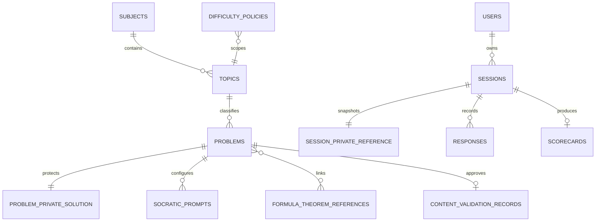

# Schema-v4 Data Dictionary

## Public or learner-readable

| Path | Purpose | Client writes |
|---|---|---|
| `users/{uid}` | Display profile, mirrored role/status, preferences, required academic profile (`studentNumber`, `course`, `yearLevel`, `section`) and completion state | Own bounded preferences/display name only; academic fields are callable-managed |
| `users/{uid}/consents/{version}` | Versioned consent acknowledgement | None |
| `subjects`, `topics` | Approved curriculum metadata; topic IDs are the learner catalog source of truth | None |
| `problems/{id}` | Public variant metadata, topic/reference IDs, validation record ID, difficulty, and prompt text | None |
| `policy_documents/{version}` | Active privacy/responsible-AI notice | None |
| `sessions/{id}` | Owner-visible server state, four-stage progress, adaptive rationale, scorecard, post-score released solution, and immutable legacy history | None |
| `sessions/{id}/responses` | Learner response plus safe evaluation/diagnosis | None |
| `sessions/{id}/scorecards` | Evidence-backed formative criterion results | None |
| `sessions/{id}/unlock_events` | Authorized support already released | None |
| `learning_progress/{uid}` | Aggregate learner progress and recommendations | None |
| `notifications/{id}` | Recipient notification | Recipient may only change `read` to true |

## Protected

| Path | Contents | Access |
|---|---|---|
| `problems/{id}/private/solution` | Validated concepts, formulas/theorems, steps, final result, interpretation, prompt map | Admin/server |
| `sessions/{id}/private/reference` | Immutable session-specific validation reference | Admin/server |
| `sessions/{id}/private_evaluations` | Internal evaluator evidence where required | Admin/server |
| `sessions/{id}/private_ai` | Raw model interaction with 90-day expiry | Admin/server |
| `socratic_prompt_bank` | Versioned managed prompt templates | Admin/server |
| `formula_theorem_references` | Conditions and validation references | Admin/server |
| `misconception_categories` | Diagnosis policy | Admin/server |
| `difficulty_policies` | Adaptation thresholds | Admin/server |
| `content_validation_records` | Immutable syllabus, content-matrix, faculty-validator, decision, date, and evidence references | Admin/server |
| `system_settings` | Privacy, retention, maintenance, and release settings | Admin/server |
| `audit_logs` | Immutable administrative/export/privacy evidence | Admin/server |
| `ai_failure_logs` | Correlated AI fallback/failure evidence | Admin/server |
| `idempotency`, `rate_limits`, `evaluation_locks` | Server control records | Server only |
| `learning_progress/{uid}/assignment_state/{topicId}` | Per-difficulty recent variant IDs used for transactional non-repeating assignment | Server only |

New sessions store safe configuration IDs/versions publicly and the resolved prompts, references, conditions, policies, and solution material in `sessions/{id}/private/reference`. Administrator edits therefore affect only sessions created after the edit. Firestore reads return whole documents, so private references must never be placed in learner-readable problem documents or the browser bundle. `scripts/migrate-v4.ts --verify` and the browser-bundle scan enforce the split.

## Problem validation lifecycle

`draft → pending_validation → approved | rejected → archived`

Only `adminRecordProblemValidation` can set `approved`. It requires a protected solution, an approved topic, approved formula/theorem references, all seven approved Socratic prompts, and an immutable external faculty-validation record. The learner catalog and session-start API remain closed until all 99 variants—three for every one of the 33 topic/difficulty cells—are approved.

## Schema-v4 relationship summary

## Retention

- Raw AI and AI failure records: delete after 90 days.
- In-progress sessions: expire after configured inactivity hours (24 by default).
- Identifiable learner records: retain through `studyClosedAt` plus `identifiableRetentionMonths` (12 by default), then pseudonymize identity while preserving aggregate research data.
- Audit logs: delete after the same configured post-study retention boundary.
